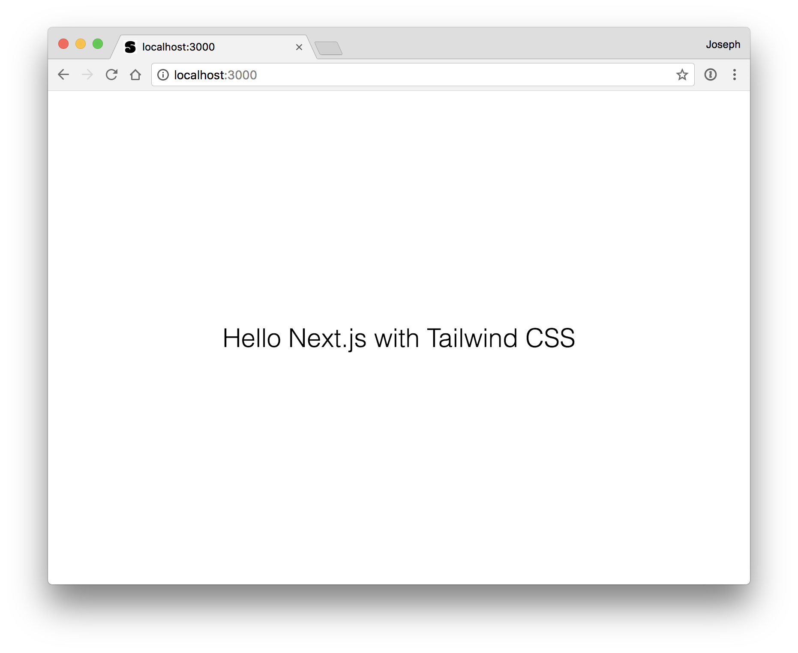

[](https://deploy.now.sh/?repo=https://github.com/joecohens/next-with-tailwindcss)
# Next.js with Tailwind CSS

This is an example of how you can use Tailwind CSS in a Next.js app.
It is based on the [Next.js with global stylesheet example](https://github.com/zeit/next.js/tree/canary/examples/with-global-stylesheet).

## How to use

Download the example [or clone the repo](https://github.com/joecohens/next-with-tailwindcss):

```bash
cd next-with-tailwindcss
```

To get this example running you just need to

```bash
npm install
npm run dev
```

Visit [http://localhost:3000](http://localhost:3000) add your own clases to `styles/index.scss`.

Deploy it to the cloud with [now](https://zeit.co/now)

```bash
now
```

